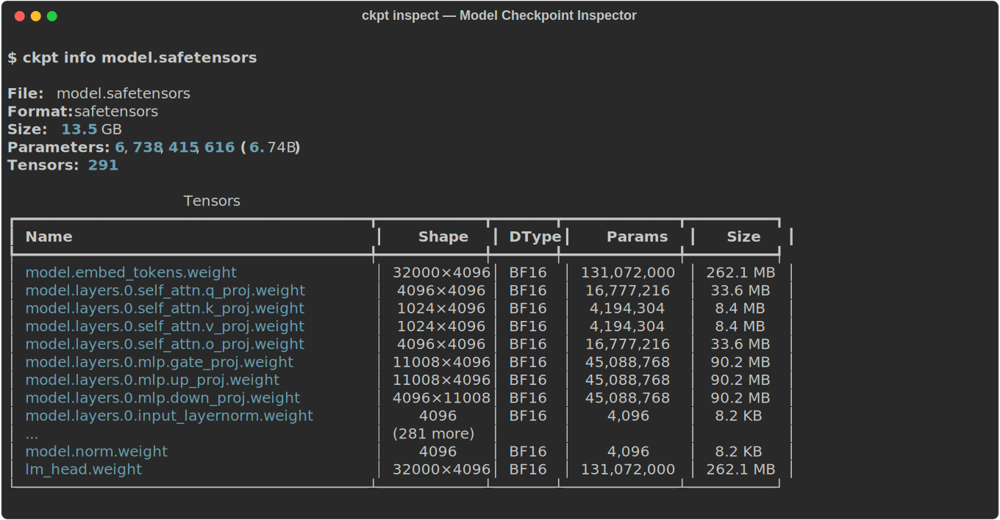
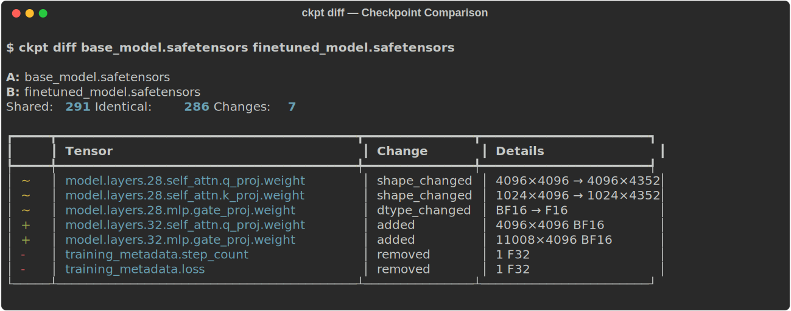

# ckpt

[](https://github.com/stef41/ckpt/actions/workflows/ci.yml)
[](https://www.python.org/downloads/)
[](https://opensource.org/licenses/Apache-2.0)

**The missing Swiss Army knife for model checkpoints.**

ckpt inspects, diffs, validates, and merges model checkpoints without loading them into GPU memory. Parse SafeTensors headers in milliseconds, compare checkpoints after fine-tuning, merge LoRA adapters, and validate file integrity — all from the command line or Python.



## Why ckpt?

Working with model weights means dealing with:

- "What layers are in this checkpoint?" → `ckpt info`
- "What changed after fine-tuning?" → `ckpt diff`
- "Is this download corrupt?" → `ckpt validate`
- "Merge this LoRA adapter into the base" → `merge_lora_state_dicts()`
- "Show me parameter counts per layer" → `ckpt stats`

mergekit handles model merging (TIES, DARE, SLERP), but nobody built the everyday checkpoint utility. ckpt is that tool.

## Install

```bash
pip install ckpt
```

With SafeTensors support (recommended):

```bash
pip install ckpt[safetensors]
```

With PyTorch support:

```bash
pip install ckpt[torch]
```

Everything:

```bash
pip install ckpt[all]
```

## CLI

### Inspect

```bash
# See what's inside a checkpoint
ckpt info model.safetensors

# JSON output for scripts
ckpt info model.safetensors --json | jq '.n_parameters'
```

### Diff

Compare two checkpoints — see what changed during fine-tuning:



```bash
ckpt diff base_model.safetensors finetuned_model.safetensors
```

### Validate

Check for corruption before a long training run:

```bash
ckpt validate model.safetensors
# ✓ model.safetensors: valid (safetensors)
```

### Stats

```bash
ckpt stats model.safetensors
```

## Python API

### Inspect

```python
from ckpt import inspect

info = inspect("model.safetensors")
print(f"Parameters: {info.n_parameters:,}")
print(f"Tensors: {info.n_tensors}")
print(f"Format: {info.format.value}")

for t in info.tensors[:5]:
    print(f"  {t.name}: {t.shape} {t.dtype.value} ({t.numel:,} params)")
```

### Diff

```python
from ckpt import diff, format_diff

result = diff("base.safetensors", "finetuned.safetensors")
print(f"Changes: {result.n_changes}")
print(f"Identical: {result.n_identical} / {result.n_shared}")

for entry in result.entries:
    print(f"  {entry.change_type}: {entry.tensor_name} — {entry.details}")
```

### Merge LoRA

```python
import torch
from ckpt import merge_lora_state_dicts

base = torch.load("base_model.bin", map_location="cpu")
adapter = torch.load("adapter_model.bin", map_location="cpu")

merged = merge_lora_state_dicts(base, adapter, alpha=1.0)
torch.save(merged, "merged_model.bin")
```

### Validate

```python
from ckpt import validate

result = validate("model.safetensors")
if not result.valid:
    for issue in result.issues:
        print(f"  {issue.severity}: {issue.message}")
```

### Stats

```python
from ckpt import inspect, stats_from_info

info = inspect("model.safetensors")
stats = stats_from_info(info)

print(f"Total size: {stats.total_size_human}")
for dtype, count in stats.dtype_counts.items():
    print(f"  {dtype}: {count:,} parameters")
```

## Format support

| Format | Inspect | Diff | Validate | Merge |
|--------|---------|------|----------|-------|
| SafeTensors | ✓ (header-only, fast) | ✓ | ✓ (full integrity) | ✓ |
| PyTorch (.bin/.pt) | ✓ (requires torch) | ✓ | basic | ✓ |

## How it works

**SafeTensors inspection is fast** because the format puts all tensor metadata (names, shapes, dtypes, offsets) in a JSON header at the start of the file. ckpt reads only the first few KB, never loading the actual weight data.

LoRA merging performs `base_weight += alpha * (lora_B @ lora_A)` for each matched layer pair, with automatic key resolution for common adapter formats (PEFT, HuggingFace).

## See Also

Part of the **stef41 LLM toolkit** — open-source tools for every stage of the LLM lifecycle:

| Project | What it does |
|---------|-------------|
| [tokonomics](https://github.com/stef41/tokonomics) | Token counting & cost management for LLM APIs |
| [datacrux](https://github.com/stef41/datacrux) | Training data quality — dedup, PII, contamination |
| [castwright](https://github.com/stef41/castwright) | Synthetic instruction data generation |
| [datamix](https://github.com/stef41/datamix) | Dataset mixing & curriculum optimization |
| [toksight](https://github.com/stef41/toksight) | Tokenizer analysis & comparison |
| [trainpulse](https://github.com/stef41/trainpulse) | Training health monitoring |
| [quantbench](https://github.com/stef41/quantbench) | Quantization quality analysis |
| [infermark](https://github.com/stef41/infermark) | Inference benchmarking |
| [modeldiff](https://github.com/stef41/modeldiff) | Behavioral regression testing |
| [vibesafe](https://github.com/stef41/vibesafe) | AI-generated code safety scanner |
| [injectionguard](https://github.com/stef41/injectionguard) | Prompt injection detection |

## License

Apache-2.0
